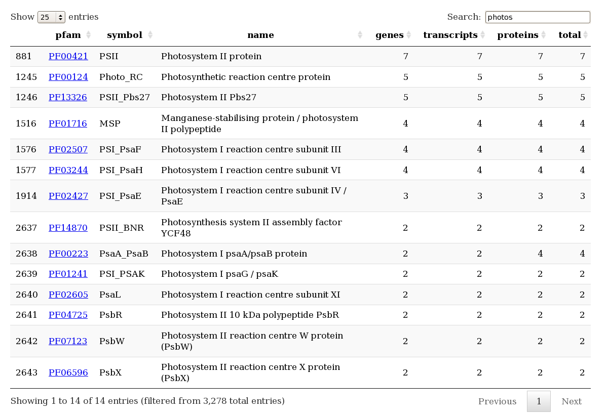

`trinotateR` is an `R` package to summarize annotation reports from [Trinotate](https://trinotate.github.io) and map to [UniProt](http://www.uniprot.org) database cross-references.  Use devtools to install the `trinotateR` package.

```
library(devtools)
install_github("cstubben/trinotateR")
```


 `read_trinotate` loads a tab-delimited Trinotate [annotation report](https://trinotate.github.io/#OutputReport) into a [data.table](https://cran.r-project.org/web/packages/data.table/index.html) for faster data manipulation.  


```r
library(trinotateR)
x <- read_trinotate("Trinotate_report.xls")
# Read 75228 rows
```

`summary_trinotate` returns the number of unique and total annotations in the table.  


```r
summary_trinotate(x)
```

```
                      unique total
gene_id                56144 75228
transcript_id          65130 75228
prot_id                59260 59260
prot_coords            26889 59260
TrEMBL_Top_BLASTX_hit  38788 47358
TrEMBL_Top_BLASTP_hit  35836 43048
Pfam                   20897 25504
sprot_Top_BLASTX_hit   18586 23806
gene_ontology_blast     5996 23569
sprot_Top_BLASTP_hit   18267 22347
gene_ontology_pfam      1428 17254
eggnog                  1456 15225
TmHMM                   6236  7907
SignalP                  100  5947
RNAMMER                   20   129
transcript                 0     0
peptide                    0     0

```


Most of the annotations contain mutliple hits in a backtick-delimited list and each hit contains multiple fields in a caret-delimited list.  For example, the second Pfam annotation below contains two hits and each hit contains a pfam id, symbol, name, alignment and e-value.  The `split_pfam` functions splits multiple hits and fields, so the second Pfam annotation is now printed in rows 2 and 3 below. 


```r
na.omit(x$Pfam)[1:2]
```

```
[1] "PF02586.9^DUF159^Uncharacterised ACR, COG2135^37-105^E:9.1e-20"                                                                                       
[2] "PF01386.14^Ribosomal_L25p^Ribosomal L25p family^50-139^E:3.8e-07`PF14693.1^Ribosomal_TL5_C^Ribosomal protein TL5, C-terminal domain^154-209^E:3.5e-09"
```

```r
x1 <- split_pfam(x)
# 46040 Pfam annotations
head(x1,3)
```

```
            gene       transcript protein    pfam          symbol                                     name   align  evalue
1: GG10000|c0_g1 GG10000|c0_g1_i1 m.81222 PF02586          DUF159             Uncharacterised ACR, COG2135  37-105 9.1e-20
2: GG10001|c2_g1 GG10001|c2_g1_i1 m.81232 PF01386  Ribosomal_L25p                    Ribosomal L25p family  50-139 3.8e-07
3: GG10001|c2_g1 GG10001|c2_g1_i1 m.81232 PF14693 Ribosomal_TL5_C Ribosomal protein TL5, C-terminal domain 154-209 3.5e-09
```

Finally, the `summary_pfam` lists the 3278 unique Pfam identifiers and the total number of genes, transcripts and proteins with a Pfam annotation.  

```r
x2 <- summary_pfam(x1)
# 3278 rows
head(x2)
```

```
      pfam      symbol                       name genes transcripts proteins total
1: PF00069     Pkinase      Protein kinase domain   655         953      999  1030
2: PF07714 Pkinase_Tyr    Protein tyrosine kinase   619         909      952   989
3: PF00400        WD40   WD domain, G-beta repeat   344         431      445   953
4: PF13504       LRR_7        Leucine rich repeat   333         383      393  2263
5: PF00023         Ank             Ankyrin repeat   299         367      404  1029
6: PF12796       Ank_2 Ankyrin repeats (3 copies)   255         321      363   739
```


The summary table also includes a `count` attribute with the number of unique genes, transcripts and proteins with a Pfam annotation, as well as the total number of annotations.  In this example, there are 19418 unique genes with a Pfam annotation (35% of all genes) and 29952 total annotations to genes (since genes may have more than one Pfam annotation).


```r
attr(x2, "count")
```

```
            unique annotations
Pfam          3278       46040
genes        19418       29952
transcripts  23700       37093
proteins     25504       38144
```

Load the [DataTables](https://rstudio.github.io/DT) to  browse and search within the table. The screenshot below shows the Pfam DataTable while searching for "photos" - the full table with all 3278 rows is available [here](http://cstubben.github.io/genomes/Pfam.html).    

```
library(DT)
 z <- data.frame(x2)
 z$pfam <- paste0('<a href="http://pfam.xfam.org/family/', z$pfam, '">', z$pfam,  '</a>')
 datatable(z , escape=1, options = list( pageLength = 25 ) )
```




The `trinotateR` packages includes similar functions to split BLAST, GO, and eggnog columns.  Additional functions to plot eggnogs and map the UniRef90 hits in the TrEMBL_Top_BLASTP_hit column to cluster names and KEGG pathways will be described on the wiki pages. 


